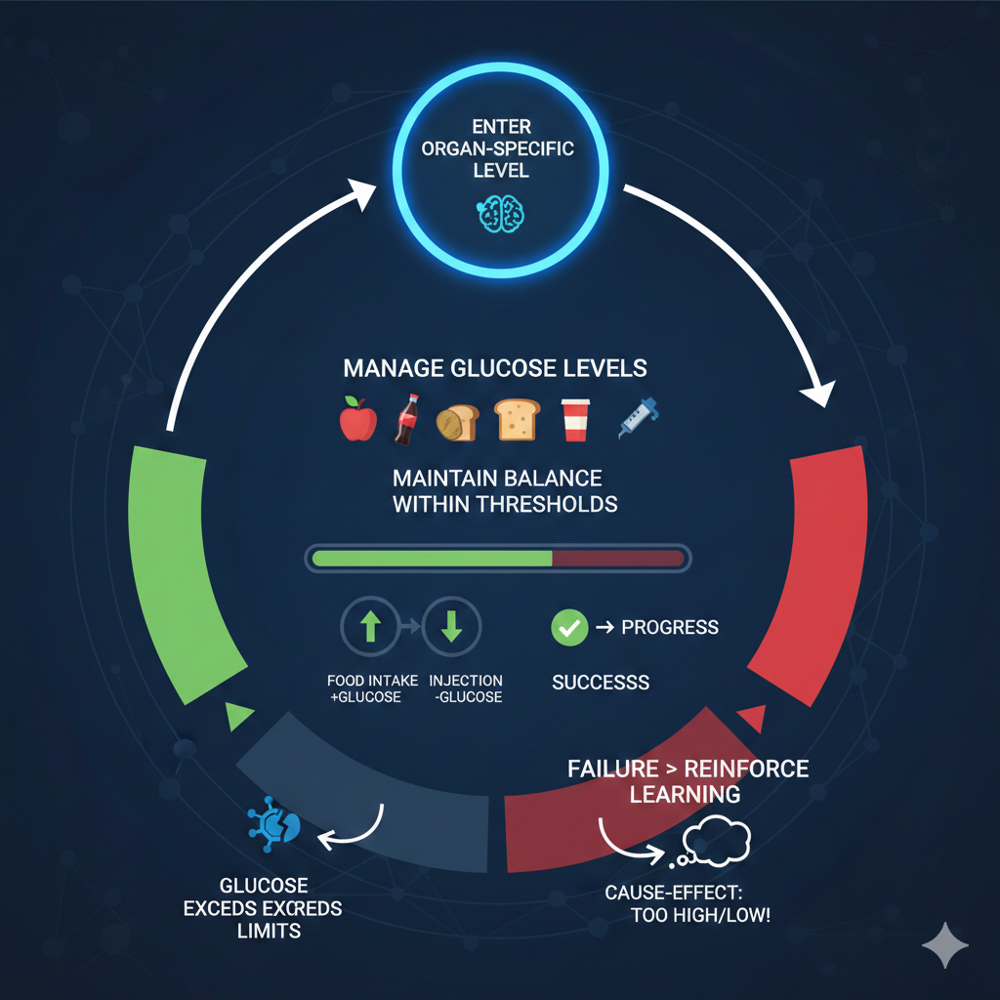

# GlucoQuest – Sugar Rush Rescue  
**Game Demo for GlucoJam by Càtedra Dexcom (2024/2025)**

## Overview

**GlucoQuest – Sugar Rush Rescue** is a serious game demo developed and presented for **GlucoJam**, a hackathon organized by **Càtedra Dexcom** during the 2024/2025 edition.

The project was created as an educational videogame experience aimed at raising awareness about diabetes, glucose regulation, and healthy nutritional habits. Core physiological concepts—such as the pancreas, insulin production, and blood glucose balance—are conveyed through gameplay mechanics rather than explicit instruction.

All educational content used in the game is based on validated resources, including materials from the **Federación Española de Diabetes (FEDE)** :contentReference[oaicite:0]{index=0}.

This repository contains the materials and documentation related to the game demo presented at the hackathon.

---

## Game Flow

The game is structured as a **level-based journey through the human body**, where each stage represents an organ involved in blood sugar regulation.

Before each level starts, the player is presented with:
- The organ being explored  
- Its role in glucose control  
- The main objective of the level  

### Core Gameplay Mechanics

- The player must keep their **glucose meter within a safe range**.
- **Healthy foods** provide steady glucose increases and help maintain balance.
- **Sugary foods** cause rapid glucose spikes and can push levels into dangerous zones.
- **Insulin pickups** can be used to counteract excessive glucose levels.

### Example: Pancreas Level

In the pancreas stage, the player learns that:
- The pancreas produces insulin.
- Insulin is required to prevent glucose from becoming too high.
- Poor dietary choices quickly destabilize glucose levels.

Difficulty increases progressively across levels, reinforcing learning through repetition, feedback, and risk management. The primary challenge is **balance**, not speed or score maximization :contentReference[oaicite:1]{index=1}.

---

## Project Objective

The project was designed around the following objectives:

- **Awareness and Education**  
  Encourage understanding of healthy habits and balanced sugar consumption.

- **Gamification of Learning**  
  Turn health education into an interactive and engaging experience.

- **Innovation in Health Communication**  
  Combine game design and educational content to promote informed nutritional decisions.

The player assumes the role of a hero combating the negative effects of excessive sugar intake in a fictional internal world. Educational content is embedded directly into gameplay, visuals, and progression systems :contentReference[oaicite:2]{index=2}.

---

## Video Demo

A full video explaining and showcasing the game demo is available on YouTube:

▶ **Game Demo – GlucoQuest: Sugar Rush Rescue**  
https://youtu.be/xhzV4WX3idI

---

## Notes

- This repository corresponds to a **prototype/demo**, not a full production game.
- The project is intended for **educational, awareness, and outreach contexts**.
- Design prioritizes clarity, accessibility, and scientific correctness.

